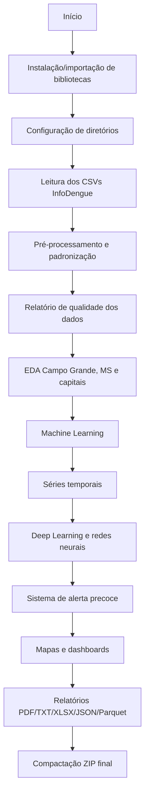

# 🦟 SIPREV Data Epidemiological InfoDeng

> **Sistema Inteligente de Previsão Epidemiológica de Dengue** com dados da plataforma **InfoDengue**, voltado à análise de recorrência/incidência de dengue em **Campo Grande/MS**, **Mato Grosso do Sul** e **capitais brasileiras**.


---

## 📌 Visão Geral

Este repositório documenta o programa **`SIPREV_Data_Epidemiological_InfoDeng`**, desenvolvido em Python/Jupyter Notebook para apoiar a análise epidemiológica de dengue por meio de dados semanais da plataforma **InfoDengue — FGV/EMAp/FIOCRUZ**.

O pipeline realiza leitura, tratamento, validação, exploração, modelagem estatística, aprendizado de máquina, redes neurais, séries temporais, visualizações, mapas, dashboards e exportação automática de relatórios.

O foco analítico está em:

- 🏙️ **Campo Grande/MS**
- 🗺️ **Municípios de Mato Grosso do Sul**
- 🇧🇷 **Capitais brasileiras**
- 📅 **Período de análise:** 2016–2025
- 🦟 **Doença:** Dengue
- 📊 **Fonte:** InfoDengue

---

## 🎯 Objetivos do Projeto

O SIPREV tem como objetivo construir um fluxo reprodutível de análise epidemiológica capaz de:

1. 📥 Ler bases semanais de dengue do InfoDengue.
2. 🧹 Padronizar, validar e enriquecer os dados epidemiológicos.
3. 📊 Realizar análise exploratória de dados para Campo Grande, MS e capitais.
4. 🧠 Aplicar modelos de **Machine Learning** para clusterização, classificação e regressão.
5. ⏳ Aplicar modelos de **séries temporais** para previsão de casos.
6. 🧬 Treinar modelos de **Deep Learning** e **Redes Neurais** para previsão e detecção de padrões.
7. 🚨 Gerar um sistema de alerta precoce para as próximas semanas.
8. 🗺️ Produzir mapas, dashboards interativos, gráficos e relatórios.
9. 📦 Compactar automaticamente todos os resultados em arquivo `.zip`.

---

## 🧩 Contexto Acadêmico

| Item | Descrição |
|---|---|
| **Disciplina** | Análise Organizacional e Soluções Tecnológicas |
| **Curso** | Ciência dos Dados |
| **Semestre** | 2026.1 |
| **Módulo** | 3 — Relatório Parcial da Ação de Extensão |
| **Tema** | Dados epidemiológicos: recorrência/incidência de dengue em Campo Grande/MS |
| **Fonte** | InfoDengue / FGV-EMAp-FIOCRUZ |
| **Ambiente** | Google Colab ou Python local |

---

## 🗂️ Arquivos de Entrada

O programa espera os arquivos `.csv` na pasta `input/csv_archive/` ou realiza download a partir das URLs configuradas no próprio código.

| Arquivo | Escopo | Descrição |
|---|---|---|
| `DENGCG-MS_16_25.csv` | Campo Grande/MS | Série semanal de dengue para Campo Grande |
| `DENGMS-BR_16_25.csv` | Mato Grosso do Sul | Série semanal dos municípios de MS |
| `DENGCAPBR_16_25.csv` | Capitais brasileiras | Série semanal das capitais do Brasil |

### 🔗 Fonte configurada no código

```text
https://raw.githubusercontent.com/OpenScienceTechnology/info_dengue/refs/heads/main/Dataset/Dengue/csv_archive/
```

---

## 🧾 Dicionário de Dados InfoDengue

| Coluna | Descrição |
|---|---|
| `data_iniSE` | Timestamp em milissegundos referente ao início da semana epidemiológica. |
| `SE` | Semana epidemiológica no padrão `YYYYSS`. |
| `casos_est` | Casos estimados pelo modelo InfoDengue. |
| `casos_est_min` / `casos_est_max` | Intervalo inferior e superior de estimativa. |
| `casos` | Casos notificados. |
| `p_rt1` | Probabilidade de `Rt > 1`. |
| `p_inc100k` | Incidência estimada por 100 mil habitantes. |
| `Localidade_id` | Código IBGE/localidade do município. |
| `nivel` | Nível de alerta: 1 verde, 2 amarelo, 3 laranja, 4 vermelho. |
| `municipio_nome` | Nome do município. |
| `Rt` | Número reprodutivo estimado. |
| `pop` | População estimada. |
| `tempmin`, `tempmed`, `tempmax` | Temperatura mínima, média e máxima. |
| `umidmin`, `umidmed`, `umidmax` | Umidade relativa mínima, média e máxima. |
| `receptivo` | Condição receptiva à transmissão. |
| `transmissao` | Indicador de transmissão ativa. |
| `nivel_inc` | Nível de incidência. |
| `casprov`, `casprov_est`, `casprov_est_min`, `casprov_est_max` | Casos prováveis e estimativas. |
| `casconf` | Casos confirmados acumulados no ano. |
| `notif_accum_year` | Notificações acumuladas no ano. |

---

## 🏗️ Estrutura Recomendada do Repositório

```text
SIPREV_Data_Epidemiological_InfoDeng/
├── README.md
├── SIPREV_Data_Epidemiological_InfoDeng.ipynb
├── SIPREV_Data_Epidemiological_InfoDeng.py
├── input/
│   └── csv_archive/
│       ├── DENGCG-MS_16_25.csv
│       ├── DENGMS-BR_16_25.csv
│       └── DENGCAPBR_16_25.csv
├── output/
│   ├── graficos/
│   ├── mapas/
│   ├── relatorios/
│   ├── modelos/
│   ├── dados/
│   ├── dashboards/
│   ├── logs/
│   └── pdf/
├── requirements.txt
└── LICENSE
```

---

## ⚙️ Instalação

### 1️⃣ Clonar o repositório

```bash
git clone https://github.com/SEU_USUARIO/SIPREV_Data_Epidemiological_InfoDeng.git
cd SIPREV_Data_Epidemiological_InfoDeng
```

### 2️⃣ Criar ambiente virtual

#### Windows PowerShell

```powershell
python -m venv .venv
.\.venv\Scripts\Activate.ps1
python -m pip install --upgrade pip
```

#### Linux/macOS

```bash
python3 -m venv .venv
source .venv/bin/activate
python -m pip install --upgrade pip
```

### 3️⃣ Instalar dependências

```bash
pip install texttable folium branca plotly kaleido xgboost lightgbm catboost shap statsmodels pmdarima scikit-learn scipy fpdf2 openpyxl xlsxwriter tensorflow keras prophet neuralprophet pyarrow fastparquet
```

### 4️⃣ Criar `requirements.txt`

```bash
pip freeze > requirements.txt
```

---

## 🚀 Como Executar

### ▶️ Opção 1 — Jupyter Notebook

```bash
jupyter notebook SIPREV_Data_Epidemiological_InfoDeng.ipynb
```

Depois, execute todas as células com:

```text
Kernel → Restart & Run All
```

### ▶️ Opção 2 — Google Colab

1. Abra o notebook no Google Colab.
2. Faça upload dos arquivos CSV ou permita o download automático.
3. Execute todas as células.
4. Ao final, o programa gera um arquivo `.zip` com os resultados.

### ▶️ Opção 3 — Converter para `.py`

```bash
jupyter nbconvert --to script SIPREV_Data_Epidemiological_InfoDeng.ipynb
python SIPREV_Data_Epidemiological_InfoDeng.py
```

---

## 🔁 Fluxo do Pipeline



---

## 🧠 Técnicas e Modelos Utilizados

### 📊 Análise Exploratória

- Distribuição temporal dos casos.
- Incidência por 100 mil habitantes.
- Sazonalidade por mês, ano, trimestre e semana epidemiológica.
- Comparação Campo Grande × MS × capitais brasileiras.
- Rankings municipais e nacionais.
- Detecção de períodos epidêmicos.

### 🧠 Machine Learning

- Clusterização de municípios.
- Classificação de nível de risco.
- Regressão de casos.
- Validação cruzada temporal.
- Detecção de anomalias com Isolation Forest.
- Modelos adicionais: Random Forest, XGBoost, LightGBM, CatBoost, SVR, KNN e MLP.

### ⏳ Séries Temporais

- ARIMA.
- SARIMA.
- Prophet.
- Holt-Winters/ETS.
- Decomposição sazonal.
- Tendência e pontos de mudança.
- Previsão das próximas semanas.

### 🧬 Deep Learning e Redes Neurais

- LSTM.
- GRU.
- Transformer simplificado.
- Autoencoder.
- Rede densa profunda.
- CNN-1D/CNN-LSTM quando disponível.

### 🔎 Interpretabilidade

- Importância de variáveis.
- SHAP values quando disponível.
- Comparação de desempenho dos modelos.
- Relatório consolidado dos modelos treinados.

---

## 🧪 Principais Funções do Programa

| Grupo | Funções |
|---|---|
| 📥 Dados | `carregar_tudo()`, `_ler_csv_infodengue()`, `_processar_infodengue()` |
| 🧹 Pré-processamento | `preprocessar_serie_temporal()`, `agregar_mensal()`, `agregar_anual()` |
| 📊 Qualidade/EDA | `relatorio_qualidade()`, `eda_visao_geral()`, `analise_campo_grande()`, `analise_municipal_ms()`, `analise_capitais()` |
| 🧠 ML | `ml_clusterizacao()`, `ml_classificacao_risco()`, `ml_regressao_casos()`, `ml_regressao_avancada()` |
| ⏳ Séries temporais | `series_temporais()`, `analise_sazonalidade_avancada()`, `analise_tendencia()` |
| 🧬 DL/NN | `deep_learning_lstm_gru()`, `redes_neurais_avancadas()` |
| 🚨 Alerta | `sistema_alerta_precoce()` |
| 🗺️ Visualização | `gerar_mapas()`, `gerar_dashboards()`, `gerar_dashboards_avancados()` |
| 📤 Exportação | `gerar_relatorio_pdf()`, `exportar_xlsx()`, `exportar_parquet_json()`, `compactar_resultados()` |
| 🧾 Sumário | `sumario_final()`, `exportar_metadados_json_final()` |

---

## 📚 Seções Analíticas Implementadas

- **Seção 0 – INSTALAÇÃO DE DEPENDÊNCIAS (Google Colab / ambiente novo)**
- **Seção 1 – IMPORTS**
- **Seção 2 – CONFIGURAÇÕES GLOBAIS**
- **Seção 3 – LOGGING**
- **Seção 4 – DADOS POPULACIONAIS E GEOGRÁFICOS**
- **Seção 5 – FUNÇÕES AUXILIARES GERAIS**
- **Seção 6 – TEXTTABLE: GERAÇÃO DE TABELAS TXT/LOG**
- **Seção 7 – CARREGAMENTO DOS DADOS INFODENGUE**
- **Seção 8 – PRÉ-PROCESSAMENTO AVANÇADO**
- **Seção 9 – RELATÓRIO DE QUALIDADE DOS DADOS**
- **Seção 10 – ANÁLISE EXPLORATÓRIA DE DADOS (EDA) – GERAL**
- **Seção 11 – ANÁLISE ESPECÍFICA: CAMPO GRANDE/MS**
- **Seção 12 – ANÁLISE MUNICIPAL: TODOS OS MUNICÍPIOS DE MS**
- **Seção 13 – ANÁLISE NACIONAL: CAPITAIS BRASILEIRAS**
- **Seção 14 – RANKINGS CONSOLIDADOS E COMPARATIVOS**
- **Seção 15 – MACHINE LEARNING: CLUSTERIZAÇÃO**
- **Seção 16 – MACHINE LEARNING: CLASSIFICAÇÃO DE RISCO**
- **Seção 17 – MACHINE LEARNING: REGRESSÃO DE CASOS**
- **Seção 18 – SÉRIES TEMPORAIS: ARIMA, SARIMA, PROPHET, ETS**
- **Seção 19 – DETECÇÃO DE ANOMALIAS E ISOLATION FOREST**
- **Seção 20 – DEEP LEARNING: LSTM, GRU, TRANSFORMER**
- **Seção 21 – REDES NEURAIS AVANÇADAS: AUTOENCODER + DENSA PROFUNDA**
- **Seção 22 – MAPAS FOLIUM: CAMPO GRANDE, MS E CAPITAIS**
- **Seção 23 – DASHBOARDS PLOTLY INTERATIVOS**
- **Seção 24 – RELATÓRIO FINAL PDF**
- **Seção 25 – EXPORTAÇÃO XLSX**
- **Seção 26 – EXPORTAÇÃO PARQUET E JSON DE METADADOS**
- **Seção 27 – RELATÓRIO CONSOLIDADO TXT**
- **Seção 28 – RELATÓRIO DE MODELOS TREINADOS**
- **Seção 29 – COMPACTAÇÃO ZIP FINAL**
- **Seção 30 – SUMÁRIO FINAL DE EXECUÇÃO**
- **Seção 31 – FUNÇÃO PRINCIPAL (main)**
- **Seção 32 – ENGENHARIA DE FEATURES AVANÇADA**
- **Seção 33 – TESTES ESTATÍSTICOS AVANÇADOS**
- **Seção 34 – ANÁLISE DE TENDÊNCIA E PONTO DE MUDANÇA**
- **Seção 35 – ANÁLISE DE RISCO POR MUNICÍPIO (ÍNDICE COMPOSTO)**
- **Seção 36 – SVR, KNN E MODELOS ADICIONAIS DE REGRESSÃO**
- **Seção 37 – VALIDAÇÃO CRUZADA TEMPORAL (TIME SERIES SPLIT)**
- **Seção 38 – ANÁLISE DE SAZONALIDADE AVANÇADA**
- **Seção 39 – ANÁLISE DE SURTOS E LIMIARES EPIDÊMICOS**
- **Seção 40 – CORRELAÇÃO ESPACIAL ENTRE MUNICÍPIOS DE MS**
- **Seção 41 – BOOTSTRAP: INTERVALOS DE CONFIANÇA PARA MÉDIAS**
- **Seção 42 – RELATÓRIO EPIDEMIOLÓGICO DETALHADO POR ANO**
- **Seção 43 – PERSISTÊNCIA DE MODELOS (SAVE / LOAD)**
- **Seção 44 – SISTEMA DE ALERTA PRECOCE (NEXT-4-WEEKS FORECAST)**
- **Seção 45 – DASHBOARDS PLOTLY AVANÇADOS**
- **Seção 46 – FICHAS MUNICIPAIS: TOP 10 MS**
- **Seção 47 – RELATÓRIO PDF EXPANDIDO (PÁGINAS ADICIONAIS)**
- **Seção 48 – XLSX AVANÇADO COM FORMATAÇÃO E GRÁFICOS EMBUTIDOS**
- **Seção 49 – RELATÓRIO DE COMPARAÇÃO EPIDEMIOLÓGICA REGIONAL**
- **Seção 50 – ANÁLISE DE VARIÁVEIS CLIMÁTICAS AVANÇADA**
- **Seção 51 – RELATÓRIO FINAL EXPANDIDO (TXT / LOG)**
- **Seção 1: Campo Grande**
- **Seção 2: Tendência**
- **Seção 3: Alerta precoce**
- **Seção 4: Resumo MS**
- **Seção 5: Nacional**
- **Seção 6: Execução**
- **Seção 52 – MAIN EXPANDIDO (INTEGRA TODAS AS SEÇÕES)**
- **Seção 53: Análise STL e Decomposição Espectral Avançada**
- **Seção 54: Análise de Clusters Temporais (K-Means por Semana Epidemiológica)**
- **Seção 55: Análise de Impacto Socioeconômico Estimado**
- **Seção 56: Análise de Vulnerabilidade e Capacidade de Resposta (Score)**
- **Seção 57: Análise de Tendência de Longo Prazo e Projeções de Incidência**
- **Seção 58: Mapa de Calor Climático-Epidemiológico**
- **Seção 59: Análise de Distribuição Espacial por Mesorregiões do MS**
- **Seção 60: Sumário Executivo Final e Metadados de Entrega**
- **Seção 58**

---

## 📤 Saídas Geradas

Ao final da execução, o SIPREV gera resultados organizados em subpastas:

| Pasta | Conteúdo |
|---|---|
| `output/graficos/` | Gráficos estáticos em `.png` |
| `output/mapas/` | Mapas interativos Folium em `.html` |
| `output/relatorios/` | Relatórios `.txt`, `.log`, `.pdf` e documentos auxiliares |
| `output/modelos/` | Modelos treinados, scalers e metadados |
| `output/dados/` | Bases tratadas, tabelas, CSV, JSON e Parquet |
| `output/dashboards/` | Dashboards interativos Plotly |
| `output/logs/` | Logs completos da execução |
| `output/pdf/` | Relatórios finais em PDF |

### 📦 Arquivo Final

O programa compacta os resultados em:

```text
SIPREV_InfoDeng_<TIMESTAMP>.zip
```

---

## 📈 Indicadores Gerados

- Total de casos notificados.
- Total de casos estimados.
- Incidência por 100 mil habitantes.
- Probabilidade de transmissão sustentada (`p_rt1`).
- Número reprodutivo `Rt`.
- Classificação por nível de alerta.
- Ranking de municípios.
- Ranking de capitais.
- Tendência temporal.
- Sazonalidade.
- Detecção de surtos.
- Índice composto de risco municipal.
- Previsão de curto prazo.
- Alerta precoce para próximas semanas.

---

## 🗺️ Mapas e Dashboards

O programa gera visualizações geoespaciais e interativas com:

- 🗺️ `folium`
- 🎨 `branca`
- 📊 `plotly`
- 📈 `matplotlib`
- 📉 `seaborn`

Exemplos de produtos:

- Mapa de Campo Grande/MS.
- Mapa dos municípios de MS.
- Mapa comparativo das capitais brasileiras.
- Dashboard epidemiológico geral.
- Dashboard de risco.
- Dashboard de séries temporais.
- Dashboard avançado de alerta precoce.

---

## 🧾 Relatórios

Os relatórios exportados incluem:

- Relatório de qualidade dos dados.
- Relatório epidemiológico de Campo Grande.
- Relatório anual.
- Relatório consolidado TXT.
- Relatório final PDF.
- Relatório expandido com análises complementares.
- Relatório de modelos treinados.
- Metadados finais em JSON.

---

## 🧠 Exemplo de Uso no Código

```python
if __name__ == "__main__":
    resultado = main()
    print("Pipeline SIPREV concluído com sucesso!")
```

---

## ✅ Requisitos Recomendados

| Recurso | Recomendação |
|---|---|
| Python | 3.10 ou superior |
| Memória RAM | 8 GB mínimo; 16 GB recomendado |
| Ambiente | Google Colab, Jupyter Notebook, VS Code ou Python local |
| Sistema | Windows, Linux ou macOS |
| Internet | Necessária para download automático dos CSVs e instalação de pacotes |

---

## 🧪 Validação e Qualidade dos Dados

O pipeline executa rotinas de validação como:

- Verificação de arquivos vazios.
- Contagem de registros lidos.
- Contagem de registros válidos.
- Identificação de valores ausentes.
- Identificação de duplicatas.
- Conversão de datas epidemiológicas.
- Validação de intervalo temporal.
- Detecção de outliers por IQR.
- Relatório de cobertura temporal.

---

## 🔐 Ética, Privacidade e Uso Responsável

Este projeto utiliza dados epidemiológicos agregados e públicos. Mesmo assim, recomenda-se:

- Não tentar identificar indivíduos.
- Não usar os resultados como diagnóstico clínico.
- Validar as conclusões com fontes oficiais.
- Utilizar as previsões como apoio à decisão, não como substituição da vigilância epidemiológica.
- Documentar limitações, vieses e incertezas dos modelos.

---

## ⚠️ Limitações

- Os resultados dependem da qualidade e atualização dos dados do InfoDengue.
- Modelos preditivos podem apresentar erro em períodos atípicos.
- Previsões epidemiológicas devem ser interpretadas com cautela.
- Dados climáticos e epidemiológicos podem conter lacunas.
- A análise não substitui boletins oficiais, investigação de campo ou decisões técnicas da saúde pública.

---

## 🧾 Sugestão de Citação

```text
VIANA, Dirceu. SIPREV Data Epidemiological InfoDeng: Sistema Inteligente de Previsão Epidemiológica de Dengue com dados InfoDengue. Campo Grande, MS, 2026. Disponível em: https://github.com/SEU_USUARIO/SIPREV_Data_Epidemiological_InfoDeng.
```

### BibTeX

```bibtex
@software{viana2026siprev_infodeng_base,
  author  = {Viana, Dirceu},
  title   = {SIPREV Data Epidemiological InfoDeng: Sistema Inteligente de Previsão Epidemiológica de Dengue},
  year    = {2026},
  address = {Campo Grande, MS},
  url     = {https://github.com/SEU_USUARIO/SIPREV_Data_Epidemiological_InfoDeng}
}
```

---

## 📄 Licença

Este projeto pode ser distribuído sob a licença **MIT**, salvo restrições específicas das fontes de dados utilizadas.

Crie um arquivo `LICENSE` com o conteúdo da licença escolhida.

---

## 👨‍💻 Autor

**Dirceu Viana**  
Campo Grande/MS — Brasil  
Projeto acadêmico e aplicado em Ciência dos Dados, epidemiologia computacional e vigilância em saúde pública.

---

## 🙏 Agradecimentos

- InfoDengue.
- FGV/EMAp.
- FIOCRUZ.
- Comunidade Python.
- Bibliotecas de ciência de dados, aprendizado de máquina e visualização.

---

## ✅ Status do Projeto

🚧 Projeto acadêmico em desenvolvimento, com pipeline funcional para análise, modelagem, visualização e exportação automática de resultados epidemiológicos.
