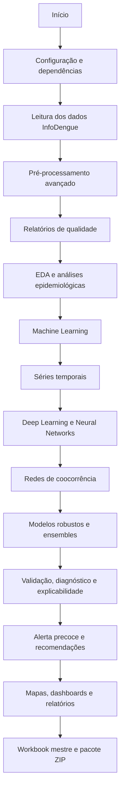

# 🦟 SIPREV v1.0 Expandido — Data Epidemiological InfoDeng

> **Sistema Inteligente de Previsão Epidemiológica de Dengue — versão expandida**, com Machine Learning, Deep Learning, Neural Networks, redes de coocorrência, modelos robustos, dashboards, relatórios consolidados e exportação completa dos resultados.


---

## 📌 Visão Geral

Este repositório documenta o programa **`BAK_SIPREV_Data_Epidemiological_InfoDeng_v1.1`**, uma versão expandida do SIPREV para análise epidemiológica de dengue com dados da plataforma **InfoDengue — FGV/EMAp/FIOCRUZ**.

A versão expandida amplia a versão-base com camadas adicionais de inteligência computacional, redes de coocorrência, inventário de bibliotecas, modelos robustos, fichas técnicas de modelos, validação temporal, diagnóstico de resíduos, correlação climática, canal endêmico, índice composto de alerta precoce e painel de recomendações de vigilância.

O notebook é **autossuficiente**, funciona localmente ou no **Google Colab**, instala dependências quando necessário e gera um pacote `.zip` final com os resultados.

---

## 🎯 Objetivos do Projeto

A versão expandida do SIPREV busca:

1. 📥 Ler e validar dados semanais de dengue do InfoDengue.
2. 🧹 Tratar e enriquecer variáveis epidemiológicas, temporais e climáticas.
3. 📊 Realizar análise exploratória completa para Campo Grande/MS, MS e capitais.
4. 🧠 Treinar modelos robustos de Machine Learning.
5. 🧬 Treinar modelos de Deep Learning com PyTorch e TensorFlow quando disponíveis.
6. 🕸️ Construir redes de coocorrência epidemiológica com NetworkX.
7. 📈 Comparar modelos com métricas consolidadas.
8. 🔎 Produzir explicabilidade, diagnóstico e validação temporal.
9. 🚨 Estimar alerta precoce e canal endêmico.
10. 🗺️ Gerar mapas, dashboards, relatórios, fichas técnicas e workbook mestre.
11. 📦 Compactar todos os resultados em `.zip`.

---

## 🧩 Contexto Acadêmico

| Item | Descrição |
|---|---|
| **Disciplina** | Análise Organizacional e Soluções Tecnológicas |
| **Curso** | Ciência dos Dados |
| **Semestre** | 2026.1 |
| **Módulo** | 4 — Relatório Expandido da Ação de Extensão |
| **Tema** | Dados epidemiológicos: recorrência/incidência de dengue em Campo Grande/MS |
| **Fonte** | InfoDengue / FGV-EMAp-FIOCRUZ |
| **Período** | 2016–2025 |
| **Cobertura** | Campo Grande/MS, 79 municípios de MS e 27 capitais brasileiras |
| **Ambiente** | Google Colab ou Python local |

---

## 🆕 Principais Expansões da Versão

A versão expandida adiciona aproximadamente **35 novas seções** sobre a base analítica original, incluindo:

- 📚 Compêndio de bibliotecas para análise de dados.
- 🕸️ Redes de coocorrência de municípios de MS.
- 🕸️ Redes de coocorrência de capitais brasileiras.
- 🌡️ Rede de associação entre variáveis climáticas e epidemiológicas.
- 🧠 Machine Learning robusto: HistGBM, ExtraTrees, RandomForest, XGBoost, LightGBM, CatBoost, Voting e Stacking.
- 🧬 Deep Learning robusto com PyTorch: LSTM, GRU e TCN.
- 🧬 Neural Networks robustas: MLP, CNN-1D e Autoencoder.
- 📑 Relatório consolidado de todos os modelos treinados.
- 📊 Dashboard consolidado de modelos.
- 🔢 Modelos de contagem: GLM Poisson e Binomial Negativa.
- 🔮 Previsão multi-passo com backtest.
- 🚦 Classificação robusta de nível de alerta.
- 🧾 Model Cards de todos os modelos.
- 🧩 Análise de comunidades em redes.
- 📘 Dicionário de dados InfoDengue.
- 📗 Catálogo de indicadores.
- 🕸️ Redes temporais anuais.
- 🧠 Super-ensemble de previsão.
- 📌 Centralidade comparada entre redes.
- 📒 Workbook mestre consolidado.
- 📕 Manual técnico e metodológico.
- ✅ Validação cruzada temporal robusta.
- 📉 Diagnóstico de resíduos.
- 🔎 Importância por permutação.
- 📏 Intervalos de predição.
- 🌡️ Correlação cruzada clima → casos.
- 📊 Decomposição de variância sazonal.
- 🚨 Índice composto de alerta precoce.
- 📈 Canal endêmico.
- 🧪 Razão de confirmação.
- 🗺️ Comparação regional Centro-Oeste.
- 🏙️ Perfil epidemiológico consolidado de Campo Grande.
- 📚 Glossário epidemiológico.
- 🧭 Painel de recomendações de vigilância e resposta.

---

## 🗂️ Arquivos de Entrada

O programa utiliza três bases principais em `.csv`:

| Arquivo | Escopo | Descrição |
|---|---|---|
| `DENGCG-MS_16_25.csv` | Campo Grande/MS | Série semanal de dengue para Campo Grande |
| `DENGMS-BR_16_25.csv` | Mato Grosso do Sul | Série semanal dos 79 municípios de MS |
| `DENGCAPBR_16_25.csv` | Capitais brasileiras | Série semanal das 27 capitais brasileiras |

### 🔗 Fonte configurada no código

```text
https://raw.githubusercontent.com/OpenScienceTechnology/info_dengue/refs/heads/main/Dataset/Dengue/csv_archive/
```

---

## 🧾 Dicionário de Dados InfoDengue

| Coluna | Descrição |
|---|---|
| `data_iniSE` | Timestamp em milissegundos referente ao início da semana epidemiológica. |
| `SE` | Semana epidemiológica no padrão `YYYYSS`. |
| `casos_est` | Casos estimados pelo modelo InfoDengue. |
| `casos_est_min` / `casos_est_max` | Intervalo inferior e superior de estimativa. |
| `casos` | Casos notificados. |
| `p_rt1` | Probabilidade de `Rt > 1`. |
| `p_inc100k` | Incidência estimada por 100 mil habitantes. |
| `Localidade_id` | Código IBGE/localidade do município. |
| `nivel` | Nível de alerta: 1 verde, 2 amarelo, 3 laranja, 4 vermelho. |
| `municipio_nome` | Nome do município. |
| `Rt` | Número reprodutivo estimado. |
| `pop` | População estimada. |
| `tempmin`, `tempmed`, `tempmax` | Temperatura mínima, média e máxima. |
| `umidmin`, `umidmed`, `umidmax` | Umidade relativa mínima, média e máxima. |
| `receptivo` | Condição receptiva à transmissão. |
| `transmissao` | Indicador de transmissão ativa. |
| `nivel_inc` | Nível de incidência. |
| `casprov`, `casprov_est`, `casprov_est_min`, `casprov_est_max` | Casos prováveis e estimativas. |
| `casconf` | Casos confirmados acumulados no ano. |
| `notif_accum_year` | Notificações acumuladas no ano. |

---

## 🏗️ Estrutura Recomendada do Repositório

```text
SIPREV_Data_Epidemiological_InfoDeng_Expandido/
├── README.md
├── BAK_SIPREV_Data_Epidemiological_InfoDeng_v1.1.ipynb
├── BAK_SIPREV_Data_Epidemiological_InfoDeng_v1.1.py
├── input/
│   └── csv_archive/
│       ├── DENGCG-MS_16_25.csv
│       ├── DENGMS-BR_16_25.csv
│       └── DENGCAPBR_16_25.csv
├── output/
│   ├── graficos/
│   ├── mapas/
│   ├── relatorios/
│   ├── modelos/
│   ├── dados/
│   ├── dashboards/
│   ├── logs/
│   ├── pdf/
│   └── redes/
├── requirements.txt
└── LICENSE
```

---

## ⚙️ Instalação

### 1️⃣ Clonar o repositório

```bash
git clone https://github.com/SEU_USUARIO/SIPREV_Data_Epidemiological_InfoDeng_Expandido.git
cd SIPREV_Data_Epidemiological_InfoDeng_Expandido
```

### 2️⃣ Criar ambiente virtual

#### Windows PowerShell

```powershell
python -m venv .venv
.\.venv\Scripts\Activate.ps1
python -m pip install --upgrade pip
```

#### Linux/macOS

```bash
python3 -m venv .venv
source .venv/bin/activate
python -m pip install --upgrade pip
```

### 3️⃣ Instalar dependências

```bash
pip install texttable folium branca plotly kaleido xgboost lightgbm catboost shap statsmodels pmdarima scikit-learn scipy fpdf2 openpyxl xlsxwriter tensorflow keras prophet neuralprophet pyarrow fastparquet networkx torch python-louvain
```

### 4️⃣ Dependências opcionais

Algumas bibliotecas são usadas quando disponíveis:

```bash
pip install neuralprophet fastparquet xlsxwriter
```

---

## 🚀 Como Executar

### ▶️ Jupyter Notebook

```bash
jupyter notebook "BAK_SIPREV_Data_Epidemiological_InfoDeng_v1.1(1).ipynb"
```

Execute todas as células:

```text
Kernel → Restart & Run All
```

### ▶️ Google Colab

1. Envie o notebook para o Google Colab.
2. Ative GPU se for usar modelos de Deep Learning.
3. Execute todas as células.
4. A última célula executa o pipeline completo e gera o `.zip` final.

### ▶️ Script `.py`

```bash
jupyter nbconvert --to script "BAK_SIPREV_Data_Epidemiological_InfoDeng_v1.1(1).ipynb"
python BAK_SIPREV_Data_Epidemiological_InfoDeng_v1.1.py
```

---

## 🔁 Fluxo Geral do Pipeline



---

## 🧠 Camadas de Inteligência Computacional

### 1️⃣ Machine Learning

Modelos e técnicas:

- Random Forest.
- ExtraTrees.
- HistGradientBoosting.
- XGBoost.
- LightGBM.
- CatBoost.
- Voting Regressor/Classifier.
- Stacking.
- SVR.
- KNN.
- MLP Regressor.
- Isolation Forest.
- Validação temporal com `TimeSeriesSplit`.

### 2️⃣ Deep Learning

Arquiteturas:

- LSTM empilhada.
- GRU bidirecional.
- TCN — Temporal Convolutional Network.
- Modelos com PyTorch.
- TensorFlow/Keras quando disponível.

### 3️⃣ Neural Networks

Arquiteturas:

- MLP profundo.
- CNN-1D.
- Autoencoder para anomalias.
- CNN-LSTM.
- Redes densas com normalização e regularização.

### 4️⃣ Redes de Coocorrência

Com `NetworkX`, o programa constrói redes para:

- Municípios de MS em alerta.
- Capitais brasileiras.
- Variáveis climáticas e epidemiológicas.
- Evolução temporal anual.
- Concordância entre modelos.
- Comunidades e centralidades.

---

## 📈 Validação, Métricas e Diagnóstico

O programa calcula e exporta métricas como:

| Tipo | Métricas |
|---|---|
| Regressão | RMSE, MAE, R², MAPE |
| Classificação | Acurácia, F1-score, matriz de confusão |
| Séries temporais | Backtest, erro multi-passo, decomposição STL |
| Modelos de contagem | Poisson, Binomial Negativa, deviance |
| Redes | Grau, centralidade, comunidades, hubs |
| Resíduos | Normalidade, autocorrelação, Durbin-Watson |
| Explicabilidade | Importância por permutação e SHAP quando disponível |

---

## 🧪 Principais Funções do Programa

| Grupo | Funções |
|---|---|
| 📥 Dados | `carregar_tudo()`, `_ler_csv_infodengue()`, `_processar_infodengue()` |
| 🧹 Pré-processamento | `preprocessar_serie_temporal()`, `agregar_mensal()`, `agregar_anual()` |
| 📊 EDA | `eda_visao_geral()`, `analise_campo_grande()`, `analise_municipal_ms()`, `analise_capitais()` |
| 🧠 ML base | `ml_clusterizacao()`, `ml_classificacao_risco()`, `ml_regressao_casos()`, `ml_regressao_avancada()` |
| 🧠 ML robusto | `ml_robusto_regressao()`, `classificacao_robusta_alerta()`, `super_ensemble_previsao()` |
| ⏳ Séries temporais | `series_temporais()`, `forecast_multipasso()`, `analise_stl_espectral()` |
| 🧬 Deep Learning | `deep_learning_lstm_gru()`, `deep_learning_robusto_pytorch()` |
| 🧬 Neural Networks | `redes_neurais_avancadas()`, `neural_networks_robustas()` |
| 🕸️ Redes | `rede_coocorrencia_municipios_ms()`, `rede_coocorrencia_capitais()`, `rede_associacao_variaveis()` |
| 📑 Modelos | `relatorio_modelos_consolidado()`, `fichas_modelos()`, `dashboard_modelos()` |
| 📗 Documentação | `dicionario_dados_infodengue()`, `catalogo_indicadores()`, `manual_tecnico_metodologico()` |
| 🚨 Vigilância | `indice_alerta_precoce()`, `canal_endemico()`, `painel_recomendacoes()` |
| 📤 Exportação | `exportar_xlsx()`, `exportar_parquet_json()`, `exportar_rede_completa()`, `compactar_resultados()` |

---

## 📚 Seções Analíticas Implementadas

- **Seção 0 – INSTALAÇÃO DE DEPENDÊNCIAS (Google Colab / ambiente novo)**
- **Seção 1 – IMPORTS**
- **Seção 2 – CONFIGURAÇÕES GLOBAIS**
- **Seção 3 – LOGGING**
- **Seção 4 – DADOS POPULACIONAIS E GEOGRÁFICOS**
- **Seção 5 – FUNÇÕES AUXILIARES GERAIS**
- **Seção 6 – TEXTTABLE: GERAÇÃO DE TABELAS TXT/LOG**
- **Seção 7 – CARREGAMENTO DOS DADOS INFODENGUE**
- **Seção 8 – PRÉ-PROCESSAMENTO AVANÇADO**
- **Seção 9 – RELATÓRIO DE QUALIDADE DOS DADOS**
- **Seção 10 – ANÁLISE EXPLORATÓRIA DE DADOS (EDA) – GERAL**
- **Seção 11 – ANÁLISE ESPECÍFICA: CAMPO GRANDE/MS**
- **Seção 12 – ANÁLISE MUNICIPAL: TODOS OS MUNICÍPIOS DE MS**
- **Seção 13 – ANÁLISE NACIONAL: CAPITAIS BRASILEIRAS**
- **Seção 14 – RANKINGS CONSOLIDADOS E COMPARATIVOS**
- **Seção 15 – MACHINE LEARNING: CLUSTERIZAÇÃO**
- **Seção 16 – MACHINE LEARNING: CLASSIFICAÇÃO DE RISCO**
- **Seção 17 – MACHINE LEARNING: REGRESSÃO DE CASOS**
- **Seção 18 – SÉRIES TEMPORAIS: ARIMA, SARIMA, PROPHET, ETS**
- **Seção 19 – DETECÇÃO DE ANOMALIAS E ISOLATION FOREST**
- **Seção 20 – DEEP LEARNING: LSTM, GRU, TRANSFORMER**
- **Seção 21 – REDES NEURAIS AVANÇADAS: AUTOENCODER + DENSA PROFUNDA**
- **Seção 22 – MAPAS FOLIUM: CAMPO GRANDE, MS E CAPITAIS**
- **Seção 23 – DASHBOARDS PLOTLY INTERATIVOS**
- **Seção 24 – RELATÓRIO FINAL PDF**
- **Seção 25 – EXPORTAÇÃO XLSX**
- **Seção 26 – EXPORTAÇÃO PARQUET E JSON DE METADADOS**
- **Seção 27 – RELATÓRIO CONSOLIDADO TXT**
- **Seção 28 – RELATÓRIO DE MODELOS TREINADOS**
- **Seção 29 – COMPACTAÇÃO ZIP FINAL**
- **Seção 30 – SUMÁRIO FINAL DE EXECUÇÃO**
- **Seção 31 – FUNÇÃO PRINCIPAL (main)**
- **Seção 32 – ENGENHARIA DE FEATURES AVANÇADA**
- **Seção 33 – TESTES ESTATÍSTICOS AVANÇADOS**
- **Seção 34 – ANÁLISE DE TENDÊNCIA E PONTO DE MUDANÇA**
- **Seção 35 – ANÁLISE DE RISCO POR MUNICÍPIO (ÍNDICE COMPOSTO)**
- **Seção 36 – SVR, KNN E MODELOS ADICIONAIS DE REGRESSÃO**
- **Seção 37 – VALIDAÇÃO CRUZADA TEMPORAL (TIME SERIES SPLIT)**
- **Seção 38 – ANÁLISE DE SAZONALIDADE AVANÇADA**
- **Seção 39 – ANÁLISE DE SURTOS E LIMIARES EPIDÊMICOS**
- **Seção 40 – CORRELAÇÃO ESPACIAL ENTRE MUNICÍPIOS DE MS**
- **Seção 41 – BOOTSTRAP: INTERVALOS DE CONFIANÇA PARA MÉDIAS**
- **Seção 42 – RELATÓRIO EPIDEMIOLÓGICO DETALHADO POR ANO**
- **Seção 43 – PERSISTÊNCIA DE MODELOS (SAVE / LOAD)**
- **Seção 44 – SISTEMA DE ALERTA PRECOCE (NEXT-4-WEEKS FORECAST)**
- **Seção 45 – DASHBOARDS PLOTLY AVANÇADOS**
- **Seção 46 – FICHAS MUNICIPAIS: TOP 10 MS**
- **Seção 47 – RELATÓRIO PDF EXPANDIDO (PÁGINAS ADICIONAIS)**
- **Seção 48 – XLSX AVANÇADO COM FORMATAÇÃO E GRÁFICOS EMBUTIDOS**
- **Seção 49 – RELATÓRIO DE COMPARAÇÃO EPIDEMIOLÓGICA REGIONAL**
- **Seção 50 – ANÁLISE DE VARIÁVEIS CLIMÁTICAS AVANÇADA**
- **Seção 51 – RELATÓRIO FINAL EXPANDIDO (TXT / LOG)**
- **Seção 52 – MAIN EXPANDIDO (INTEGRA TODAS AS SEÇÕES)**
- **Seção 58**
- **Seção 64 – COMPÊNDIO DE BIBLIOTECAS PARA DATA ANALYSIS**
- **Seção 65 – REDE DE COOCORRÊNCIA: MUNICÍPIOS DE MS EM ALERTA**
- **Seção 66 – REDE DE COOCORRÊNCIA: CAPITAIS BRASILEIRAS**
- **Seção 67 – REDE DE ASSOCIAÇÃO ENTRE VARIÁVEIS (CLIMA × EPIDEMIOLOGIA)**
- **Seção 68 – MACHINE LEARNING ROBUSTO (MODELO 1)**
- **Seção 69 – DEEP LEARNING ROBUSTO (MODELO 2): PyTorch LSTM / GRU / TCN**
- **Seção 70 – NEURAL NETWORKS ROBUSTAS (MODELO 3): MLP / CNN-1D / Autoencoder**
- **Seção 71 – RELATÓRIO CONSOLIDADO DE TODOS OS MODELOS TREINADOS**
- **Seção 72 – DASHBOARD E EXPORTAÇÃO CONSOLIDADA DOS MODELOS**
- **Seção 64 — Compêndio de bibliotecas**
- **Seção 71 — Relatório consolidado de modelos**
- **Seção 72 — Dashboard consolidado + rede de concordância**
- **Seção 76 — Fichas técnicas (model cards) de todos os modelos**
- **Seção 77 — Análise de comunidades das redes de coocorrência**
- **Seção 78 — Dicionário de dados InfoDengue**
- **Seção 79 — Catálogo de indicadores + sumário executivo v1.0**
- **Seção 80 — Redes de coocorrência temporais (evolução anual)**
- **Seção 81 — Super-ensemble de previsão (ML + DL)**
- **Seção 82 — Centralidade comparada entre redes**
- **Seção 83 — Exportação mestre (workbook XLSX consolidado)**
- **Seção 84 — Manual técnico e metodológico**
- **Seção 89 — Comparação final multi-métrica dos modelos**
- **Seção 97 — Glossário epidemiológico**
- **Seção 98 — Painel de recomendações de vigilância**
- **Seção 73 – MODELOS DE CONTAGEM: GLM POISSON & BINOMIAL NEGATIVA**
- **Seção 74 – PREVISÃO MULTI-PASSO (HORIZONTE) COM FORECAST RECURSIVO**
- **Seção 75 – CLASSIFICAÇÃO ROBUSTA DE NÍVEL DE ALERTA (MULTICLASSE)**
- **Seção 76 – FICHAS DETALHADAS (MODEL CARDS) DE CADA MODELO TREINADO**
- **Seção 77 – ANÁLISE DE COMUNIDADES DAS REDES DE COOCORRÊNCIA**
- **Seção 78 – DICIONÁRIO DE DADOS INFODENGUE**
- **Seção 79 – CATÁLOGO DE INDICADORES + SUMÁRIO EXECUTIVO v1.0**
- **Seção 80 – REDES DE COOCORRÊNCIA TEMPORAIS (EVOLUÇÃO ANUAL)**
- **Seção 81 – SUPER-ENSEMBLE DE PREVISÃO (ML + DL + GLM)**
- **Seção 82 – CENTRALIDADE COMPARADA ENTRE REDES**
- **Seção 83 – EXPORTAÇÃO MESTRE: WORKBOOK XLSX CONSOLIDADO**
- **Seção 84 – MANUAL TÉCNICO E METODOLÓGICO DA EXPANSÃO v1.0**
- **Seção 85 – VALIDAÇÃO CRUZADA TEMPORAL ROBUSTA (TimeSeriesSplit)**
- **Seção 86 – DIAGNÓSTICO DE RESÍDUOS DO MELHOR MODELO**
- **Seção 87 – IMPORTÂNCIA POR PERMUTAÇÃO**
- **Seção 88 – INTERVALOS DE PREDIÇÃO (REGRESSÃO QUANTÍLICA)**
- **Seção 89 – COMPARAÇÃO FINAL MULTI-MÉTRICA DOS MODELOS**
- **Seção 90 – CORRELAÇÃO CRUZADA CLIMA → CASOS (LAGS DEFASADOS)**
- **Seção 91 – DECOMPOSIÇÃO DE VARIÂNCIA SAZONAL (STL)**
- **Seção 92 – ÍNDICE COMPOSTO DE ALERTA PRECOCE (EARLY WARNING SCORE)**
- **Seção 93 – CANAL ENDÊMICO (DIAGRAMA DE CONTROLE)**
- **Seção 94 – RAZÃO DE CONFIRMAÇÃO E ANÁLISE DE CASOS CONFIRMADOS/PROVÁVEIS**
- **Seção 95 – COMPARAÇÃO REGIONAL CENTRO-OESTE (CAPITAIS)**
- **Seção 96 – PERFIL EPIDEMIOLÓGICO CONSOLIDADO DE CAMPO GRANDE**
- **Seção 97 – GLOSSÁRIO EPIDEMIOLÓGICO**
- **Seção 98 – PAINEL DE RECOMENDAÇÕES DE VIGILÂNCIA E RESPOSTA**

---

## 📤 Saídas Geradas

A versão expandida gera mais tipos de artefatos que a versão-base.

| Pasta | Conteúdo |
|---|---|
| `output/graficos/` | Gráficos `.png` e imagens analíticas |
| `output/mapas/` | Mapas interativos Folium `.html` |
| `output/relatorios/` | Relatórios `.txt`, `.log`, `.md`, `.pdf` |
| `output/modelos/` | Modelos, scalers, manifestos e metadados |
| `output/dados/` | CSV, JSON, XLSX, Parquet e tabelas consolidadas |
| `output/dashboards/` | Dashboards Plotly `.html` |
| `output/logs/` | Logs completos de execução |
| `output/pdf/` | Relatórios formais em PDF |
| `output/redes/` | Redes `.graphml`, métricas, arestas e dashboards de rede |

### Exemplos de arquivos exportados

```text
compendio_bibliotecas_<TIMESTAMP>.csv
compendio_bibliotecas_<TIMESTAMP>.xlsx
compendio_bibliotecas_<TIMESTAMP>.json
rede_<nome>_<TIMESTAMP>.graphml
metricas_rede_<nome>_<TIMESTAMP>.csv
ml_robusto_ranking_<TIMESTAMP>.csv
relatorio_modelos_consolidado_<TIMESTAMP>.xlsx
forecast_multipasso_<TIMESTAMP>.csv
fichas_modelos_<TIMESTAMP>.md
workbook_mestre_<TIMESTAMP>.xlsx
manual_metodologico_<TIMESTAMP>.md
indice_alerta_precoce_<TIMESTAMP>.csv
canal_endemico_<TIMESTAMP>.csv
perfil_epidemiologico_cg_<TIMESTAMP>.json
glossario_epidemiologico_<TIMESTAMP>.md
painel_recomendacoes_<TIMESTAMP>.md
```

### 📦 Arquivo final

```text
SIPREV_InfoDeng_<TIMESTAMP>.zip
```

---

## 🗺️ Mapas, Dashboards e Redes

A versão expandida produz:

- 🗺️ Mapas Folium de Campo Grande, MS e capitais.
- 📊 Dashboards Plotly epidemiológicos.
- 🧠 Dashboard consolidado de modelos.
- 🕸️ Redes interativas de coocorrência.
- 🧭 Análise de comunidades.
- 📌 Centralidade comparada entre redes.
- 📈 Painéis de alerta e vigilância.

---

## 📘 Documentação Gerada Automaticamente

O próprio pipeline também produz documentação técnica:

- Dicionário de dados InfoDengue.
- Catálogo de indicadores epidemiológicos.
- Glossário epidemiológico.
- Manual técnico e metodológico.
- Model cards dos modelos treinados.
- Sumário executivo.
- Painel de recomendações de vigilância.

---

## 🚦 Sistema de Alerta e Recomendações

A versão expandida cria um sistema de apoio à vigilância com níveis de alerta:

| Nível | Cor | Interpretação |
|---|---|---|
| 1 | 🟢 Verde | Sem alerta |
| 2 | 🟡 Amarelo | Alerta baixo |
| 3 | 🟠 Laranja | Alerta médio |
| 4 | 🔴 Vermelho | Alerta alto |

O painel final sugere ações proporcionais ao risco, como:

- Vigilância entomológica.
- Comunicação de risco.
- Eliminação de criadouros.
- Busca ativa de casos.
- Bloqueio vetorial em hotspots.
- Ampliação de capacidade assistencial.
- Sala de situação em cenário crítico.

---

## 🧾 Exemplo de Execução

```python
if __name__ == "__main__":
    _resultados = main()
```

No notebook, a execução final também pode chamar o pipeline completo ao rodar todas as células.

---

## ✅ Requisitos Recomendados

| Recurso | Recomendação |
|---|---|
| Python | 3.10 ou superior |
| RAM | 16 GB recomendado |
| GPU | Opcional, recomendada para PyTorch/TensorFlow |
| Ambiente | Google Colab, Jupyter Notebook, VS Code ou Python local |
| Sistema | Windows, Linux ou macOS |
| Internet | Necessária para instalação de pacotes e download dos CSVs |

---

## 🔐 Ética, Privacidade e Uso Responsável

Este projeto utiliza dados epidemiológicos agregados, públicos e não identificáveis. Recomendações:

- Não interpretar previsões como certeza epidemiológica.
- Validar resultados com boletins e fontes oficiais.
- Usar modelos como apoio à decisão.
- Não substituir profissionais da saúde ou vigilância epidemiológica.
- Comunicar incertezas dos modelos.
- Evitar uso indevido em políticas públicas sem validação técnica.

---

## ⚠️ Limitações

- Acurácia depende da completude e atualização dos dados InfoDengue.
- Modelos podem ser sensíveis a anos epidêmicos atípicos.
- Séries temporais de saúde pública sofrem atraso de notificação.
- Redes de coocorrência indicam associação, não causalidade.
- Resultados devem ser revisados por especialistas em epidemiologia e saúde pública.

---

## 🧾 Sugestão de Citação

```text
VIANA, Dirceu. SIPREV v1.0 Expandido: Sistema Inteligente de Previsão Epidemiológica de Dengue com Machine Learning, Deep Learning e Redes de Coocorrência. Campo Grande, MS, 2026. Disponível em: https://github.com/SEU_USUARIO/SIPREV_Data_Epidemiological_InfoDeng_Expandido.
```

### BibTeX

```bibtex
@software{viana2026siprev_infodeng_expandido,
  author  = {Viana, Dirceu},
  title   = {SIPREV v1.0 Expandido: Sistema Inteligente de Previsão Epidemiológica de Dengue},
  year    = {2026},
  address = {Campo Grande, MS},
  url     = {https://github.com/SEU_USUARIO/SIPREV_Data_Epidemiological_InfoDeng_Expandido}
}
```

---

## 📄 Licença

Sugestão: **MIT License**.

Inclua um arquivo `LICENSE` no repositório ou adapte conforme exigências acadêmicas e institucionais.

---

## 👨‍💻 Autor

**Dirceu Viana**  
Campo Grande/MS — Brasil  
Projeto acadêmico/aplicado em Ciência dos Dados, epidemiologia computacional, vigilância em saúde pública e inteligência artificial.

---

## 🙏 Agradecimentos

- InfoDengue.
- FGV/EMAp.
- FIOCRUZ.
- Comunidade Python.
- Projetos open source de Ciência de Dados, Epidemiologia Computacional e Inteligência Artificial.

---

## ✅ Status do Projeto

🚀 Versão expandida funcional, com pipeline integrado para 98 seções analíticas, geração de relatórios, dashboards, redes, modelos e pacote final `.zip`.
